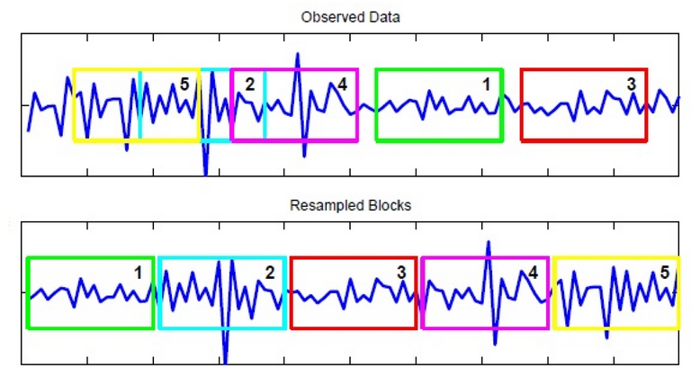

### Hello! I'm Marc Chen. 

- I'm currently a Machine Learning Engineer at Columbia University's Emerging Tech group. We develop ML workflows for researchers, and serve as a general ML resource to the Columbia community at large. 
- Since graduating from my MMath program, I've also been a visiting ML researcher at the University of Waterloo, where I support the computational finance research of Profs. [Yuying Li](https://cs.uwaterloo.ca/~yuying/) and [Peter Forsyth](https://cs.uwaterloo.ca/~paforsyt/).
- I recently graduated from uWaterloo with a Master of Mathematics in Data Science, and completed my [thesis](https://uwspace.uwaterloo.ca/handle/10012/19874), which develops a robust RNN model to solve for optimal strategies in portfolio and risk management. I wrote a short [article](/mmath_summary.pdf) that summarizes this research. I am unable to share the code of the entire RNN framework, but a piece of it is highlighted below.  
- My co-authored ML finance research has been submitted to the Journal of Computational Finance, and is available as a [pre-print](https://arxiv.org/abs/2306.10582). 
- On this personal Github, I share select data science projects from outside my professional work.

### Highlighted Projects:

#### [Gear Gleaner](https://geargleaner.com)  

|  | Gear Gleaner helps users discover the hidden treasure on Reddit's buy/sell groups for all kinds of items like PC hardware, hiking gear, etc. It is a Django webapp that leverages LLMs to aggregate reddit posts and parse them into a standardized database, allowing users to easily browse and search items. |
|------------------------------------------------|---------------------------------------------------------------------------------------------------------------------------------------------------------------------------------------------------------------------------------------------------------------------------------------------------------------------|

#### [Market Data Bootstrapper](https://github.com/marcchen2/market_data_bootstrap/)  

|  <em>Diagram credit to <a href="https://journals.plos.org/plosone/article?id=10.1371/journal.pone.0131111">El Anbari, Abeer, and Ptitsyn (2015)</a></em> | A common problem in ML finance research is the availability of asset return data. It is often necessary to generate synthetic time series data with similar statistical properties as the historical market for training and rigorous strategy testing. One of the methods most widely accepted to be the gold standard by finance practitioners is stationary block bootstrapping (Patton et al., 2009) of historical return data. This tool was implemented as part of a larger ML framework I implemented to create optimal portfolio management strategies for my Masters research. |
|------------------------------------------------------------------------------------------------------------------------------------------------------------------------------------------|-----------------------------------------------------------------------------------------------------------------------------------------------------------------------------------------------------------------------------------------------------------------------------------------------------------------------------------------------------------------------------------------------------|

#### Mapping transit accessibilty for the Nashville Metro Planning Authority  

|  | For my undergraduate economics thesis, I consulted for the Nashville MPO to help them understand the impact of transit access on labor market participation in the Nashville region. I leveraged the Bing Maps API to create an index of transit accessibility in urban areas. I then developed a segmented regression to analyze this index's impact on labor force participation rates within disparate income groups. [Thesis](https://ir.vanderbilt.edu/handle/1803/10359). [Vanderbilt University News Article](https://news.vanderbilt.edu/2017/04/28/class-of-2017-marc-chen/). |
|------------------------------------------------------------------------------------------------------------------------------------------------------|-----------------------------------------------------------------------------------------------------------------------------------------------------------------------------------------------------------------------------------------------------------------------------------------------------------------------------------------------------------------------------------------------------|
